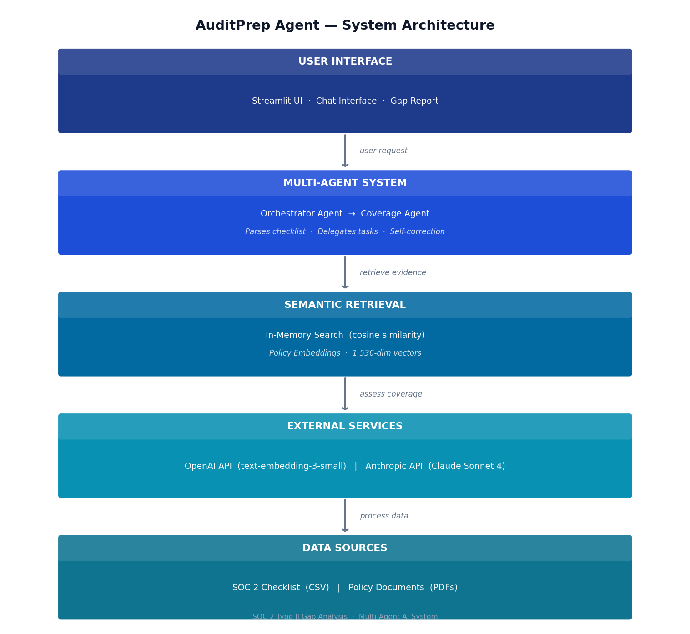

# AuditPrep Agent
Multi-agent audit gap analysis system

## Live App

[https://audit-prep-agent.streamlit.app](https://audit-prep-agent.streamlit.app)

## Architecture

The Audit Prep RAG Agent follows a five-stage retrieval-augmented generation pipeline. During ingestion, CMS policy documents are split into overlapping chunks, converted to 1536-dim vectors via OpenAI `text-embedding-ada-002`, and stored in a Pinecone vector index. At query time, the auditor's natural-language question is embedded with the same model and used to retrieve the top-K most semantically similar chunks via cosine similarity. Those chunks are assembled into an augmented prompt — together with a system message that constrains Claude to the provided context — passed through a guardrails check, and sent to `claude-3-5-sonnet`. The model returns a grounded answer with full source citations traceable to specific documents and chunk IDs.



**[▶ Open interactive diagram](diagrams/rag-agent-architecture.html)** — click any node to explore components, use step buttons to walk through the pipeline.

## Project Structure

```
auditprep-agent/
├── data/
│   ├── synthetic/          # Synthetic audit documents for demonstration
│   │   ├── policies/       # Policy documents (PDF/text)
│   │   ├── checklists/     # Audit checklists
│   │   └── metadata/       # Document metadata
│   └── embeddings/         # Pre-computed vector embeddings (gitignored)
├── src/
│   ├── agents/             # Multi-agent orchestration layer
│   │   ├── agent_base.py   # Shared base class for all agents
│   │   ├── orchestrator.py # Root orchestrator agent
│   │   └── coverage_agent.py # SOC 2 coverage analysis agent
│   ├── retrieval/          # Semantic retrieval abstraction
│   │   ├── retrieval_interface.py   # Abstract retrieval interface
│   │   └── in_memory_retrieval.py  # In-memory vector store implementation
│   ├── utils/              # Shared utilities
│   │   ├── pdf_parser.py   # PDF text extraction
│   │   ├── chunking.py     # Document chunking strategies
│   │   └── embedding_generator.py  # Embedding generation via OpenAI
│   └── ui/
│       └── streamlit_app.py  # Streamlit frontend
└── scripts/
    ├── generate_embeddings.py  # Precompute and cache embeddings
    └── validate_retrieval.py   # Smoke-test retrieval quality
```

## v1 Scope
- SOC 2 Type II audit gap analysis
- Synthetic dataset demonstration
- Multi-agent orchestration (Orchestrator + Coverage Agent)
- Semantic retrieval with abstraction layer
